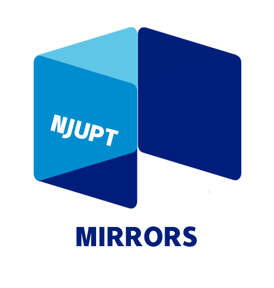
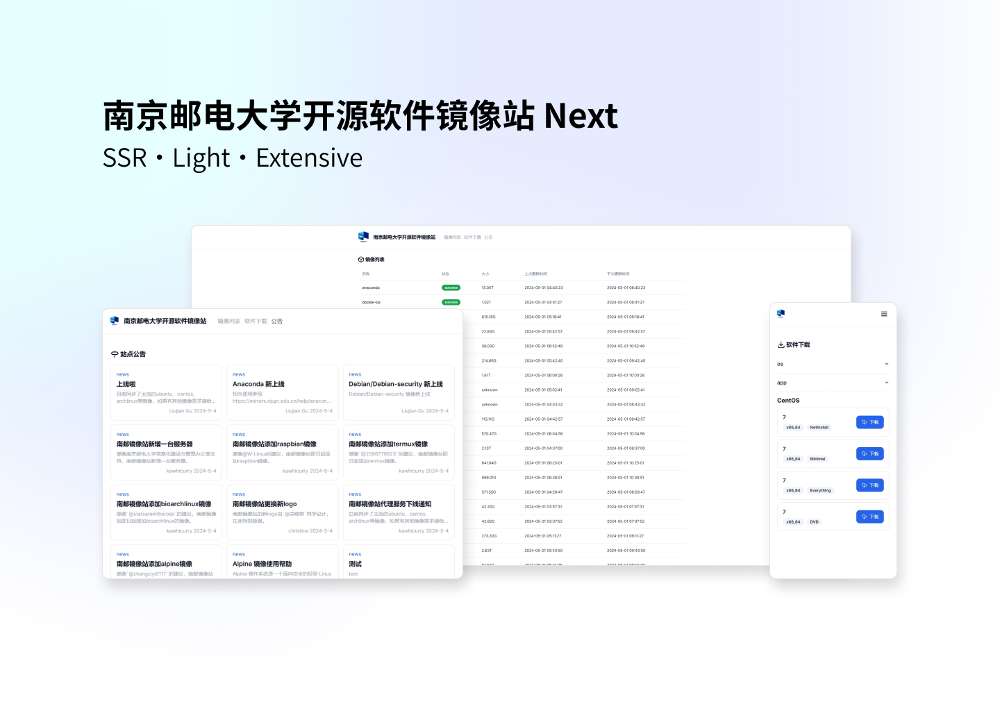

# NJUPT Mirror Web

南京邮电大学开源软件镜像站网页端



## 开发技术栈

- React
- Tailwind CSS
- MDX

## 开发指南

### 目录结构

- src: 源码
- content: 网站内容
- public: 网站静态资源

### 开发前准备

- Nvim：安装 Biome LSP
- VScode：安装 Biome 插件
- 使用 Node 版本 ^20
- 使用 PNPM 作为包管理器 ^9

安装所需依赖
```bash
pnpm install
```
启动调试
```bash
pnpm dev
```

### 编译与部署
网站可以使用 Docker 部署，使用 Next standalone 模式，可以直接使用以下命令构建与运行
```bash
docker build -t mirror-web-next .
docker run -p 3000:3000 --name mirror-web-next mirror-web-next
```

## 内容维护
网站的所有内容都在 content 中，可以创建不同的文件夹作为不同的分类，比如 News、Help等，Help 会自动与镜像联动，支持使用 Markdown 与 MDX